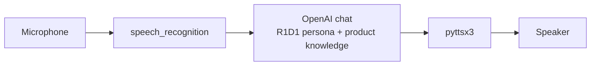

# convAI 🗣️

> A minimal voice assistant loop: microphone → speech‑to‑text → GPT with a product‑specific system persona → text‑to‑speech. Built as the conversational prototype for the OpenDroids **R1D1** home robot.

[](https://www.python.org/)
[](https://platform.openai.com/)
[](LICENSE)



## Run

```bash
pip install -r requirements.txt
export OPENAI_API_KEY=...          # read from env; nothing hard‑coded
python app.py
```

The persona and product knowledge live in `system_instruction` inside `app.py`; edit it to repurpose the assistant for any product.

## License

MIT — see [LICENSE](LICENSE).
